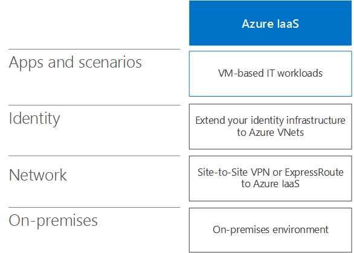
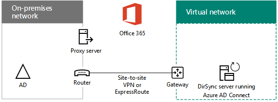
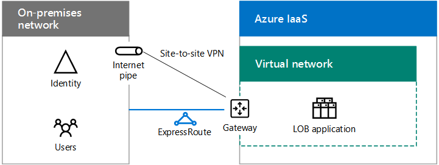

# Hybrid cloud scenarios for Azure IaaS

 **Summary:** Understand the hybrid architecture and scenarios for Microsoft's Infrastructure as a Service (IaaS)-based cloud offerings in Azure.
  
Extend your on-premises computing and identity infrastructure into the cloud by hosting IT workloads running in cross-premises Azure virtual networks (VNets). 
  
## Azure IaaS hybrid scenario architecture

Figure 1 shows the architecture of Microsoft IaaS-based hybrid scenarios in Azure.
  
**Figure 1: Microsoft IaaS-based hybrid scenarios in Azure**

  
For each layer of the architecture:
  
- Apps and scenarios
    
    An IT workload is typically a multi-tier, highly-available application composed of Azure virtual machines (VMs).
    
- Identity
    
    Add identity servers, such as Windows Server AD domain controllers, to the set of servers running in Azure VNets for local authentication.
    
- Network
    
    Use either a site-to-site VPN connection over the Internet or an ExpressRoute connection with private peering to Azure IaaS.
    
- On-premises
    
    Contains identity servers that are synchronized with the identity servers running in Azure. Can also contain resources that VMs running in Azure can access, such as storage and systems management infrastructure.
    
## Directory synchronization server for Office 365

Running your directory synchronization server from an Azure VNet, as shown in Figure 2, is an example of extending your computing and identity infrastructure to the cloud.
  
**Figure 2: Directory synchronization server for Office 365 in Azure IaaS**

  
In Figure 2, an on-premises network hosts a Windows Server AD infrastructure, with a proxy server and a router at its edge. The router connects to an Azure gateway at the edge of an Azure VNet with a site-to-site VPN or ExpressRoute connection. Inside the VNet, a directory synchronization server runs Azure AD Connect.
  
A directory synchronization server for Office 365 synchronizes the list of accounts in Windows Server AD with the Azure AD tenant of an Office 365 subscription.
  
A directory synchronization server is a Windows-based server that runs Azure AD Connect. For faster provisioning or to reduce the number of on-premises servers in your organization, deploy your directory synchronization server in a virtual network (VNet) in Azure IaaS.
  
The directory synchronization server polls Windows Server AD for changes and then synchronizes them with the Office 365 subscription.
  
For more information, see [Deploy Office 365 Directory Synchronization in Microsoft Azure](deploy-office-365-directory-synchronization-dirsync-in-microsoft-azure.md).
  
## Line of business (LOB) application

Figure 3 shows the configuration of a server-based LOB application running in Azure IaaS.
  
**Figure 3: LOB application in Azure IaaS**

  
In Figure 3, an on-premises network hosts an identity infrastructure and users. It is connected to an Azure IaaS gateway with a site-to-site VPN or ExpressRoute connection. Azure IaaS hosts a virtual network containing the servers of the LOB application.
  
You can create LOB applications running on Azure VMs, which reside on subnets of an Azure VNet in an Azure datacenter (also known as a location).
  
Because you are essentially extending your on-premises infrastructure to Azure, you must assign unique private address space to your VNets and update your on-premises routing tables to ensure reachability to each VNet.
  
Once connected, these VMs can be managed with remote desktop connections or with your systems management software, just like your on-premises servers.
  
By configuring publically-exposed ports, these VMs can also be accessed from the Internet by mobile or remote users.
  
For a proof-of-concept configuration, see [Simulated cross-premises virtual network in Azure](simulated-cross-premises-virtual-network-in-azure.md).
  
Attributes of LOB applications hosted on Azure VMs are the following:
  
- Multiple tiers
    
    Typical LOB applications use a tiered approach. Sets of servers provide identity, database processing, application and logic processing, and front-end web servers for employee or customer access. 
    
- High availability
    
    Typical LOB applications provide high availability by using multiple servers in each tier. Azure IaaS provides a 99.9% uptime SLA for servers in Azure availability sets. 
    
- Load distribution
    
    To distribute the load of network traffic among multiple servers in a tier, you can use an Internet-facing or internal Azure load balancer. Or, you can use a dedicated load balancer appliance available from the Azure marketplace.
    
- Security
    
    To protect servers from unsolicited incoming traffic from the Internet, you can use Azure network security groups. You can define allowed or denied traffic for a subnet or the network interface of an individual virtual machine.
    
## SharePoint Server 2016 farm in Azure

An example of a multi-tier, highly-available LOB application in Azure is a SharePoint Server 2016 farm, as shown in Figure 4.
  
**Figure 4: A high-availability SharePoint Server 2016 farm in Azure IaaS**

  
In Figure 4, an on-premises network hosts an identity infrastructure and users. It is connected to an Azure IaaS gateway with a site-to-site VPN or ExpressRoute connection. The Azure VNet contains the servers of the SharePoint Server 2016 farm, which includes separate tiers for the front-end servers, the application servers, the SQL Server cluster, and the domain controllers.
  
This configuration has the following attributes of LOB applications in Azure: 
  
- Tiers
    
    Servers running different roles within the farm create the tiers and each tier has its own subnet.
    
- High-availability
    
    Achieved by using more than one server in each tier and placing all the servers of a tier in the same availability set.
    
- Load distribution
    
    Internal Azure load balancers distribute the incoming client web traffic to the front-end servers (WEB1 and WEB2) and to the listener IP address of the SQL Server cluster (SQL1, SQL2, and MN1).
    
- Security
    
    Network security groups for each subnet let you to configure allowed inbound and outbound traffic.
    
Follow this path for successful adoption:
  
1. Evaluate and experiment
    
    See [SharePoint Server 2016 in Microsoft Azure](https://docs.microsoft.com/SharePoint/administration/sharepoint-server-2016-in-microsoft-azure) to understand the benefits of running SharePoint Server 2016 in Azure.
    
    See [Intranet SharePoint Server 2016 in Azure dev/test environment](https://docs.microsoft.com/SharePoint/administration/intranet-sharepoint-server-2016-in-azure-dev-test-environment) to build a simulated dev/test environment
    
2. Design
    
    See [Designing a SharePoint Server 2016 farm in Azure](https://docs.microsoft.com/SharePoint/administration/designing-a-sharepoint-server-2016-farm-in-azure) to step through a process to determine the set of Azure IaaS networking, compute, and storage elements to host your farm and their settings.
    
3. Deploy
    
    See [Deploying SharePoint Server 2016 with SQL Server AlwaysOn Availability Groups in Azure](https://docs.microsoft.com/SharePoint/administration/deploying-sharepoint-server-2016-with-sql-server-alwayson-availability-groups-in) to step through the end-to-end configuration of the high-availability farm in five phases.
    
## Federated identity for Office 365 in Azure

Another example of a multi-tier, highly-available LOB application in Azure is federated identity for Office 365.
  
**Figure 5: A high-availability federated identity infrastructure for Office 365 in Azure IaaS**

  
In Figure 5, an on-premises network hosts an identity infrastructure and users. It is connected to an Azure IaaS gateway with a site-to-site VPN or ExpressRoute connection. The Azure VNet contains web proxy servers, Active Directory Federation Services (AD FS) servers, and Active Directory Domain Services (AD DS) domain controllers.
  
This configuration has the following attributes of LOB applications in Azure:
  
- **Tiers:** There are tiers for web proxy servers, AD FS servers, and Windows Server AD domain controllers.
    
- **Load distribution:** An external Azure load balancer distributes the incoming client authentication requests to the web proxies and an internal Azure load balancer distributes authentication requests to the AD FS servers.
    
Follow this path for successful adoption:
  
1. Evaluate and experiment
    
    See [Federated identity for your Office 365 dev/test environment](federated-identity-for-your-office-365-dev-test-environment.md) to build a simulated dev/test environment for federated authentication with Office 365.
    
2. Deploy
    
    See [Deploy high availability federated authentication for Office 365 in Azure](deploy-high-availability-federated-authentication-for-office-365-in-azure.md) to step through the end-to-end configuration of the high availability AD FS infrastructure in five phases.
    
    
## See Also

[Microsoft Hybrid Cloud for Enterprise Architects](microsoft-hybrid-cloud-for-enterprise-architects.md)
  
[Microsoft Cloud IT architecture resources](microsoft-cloud-it-architecture-resources.md)

